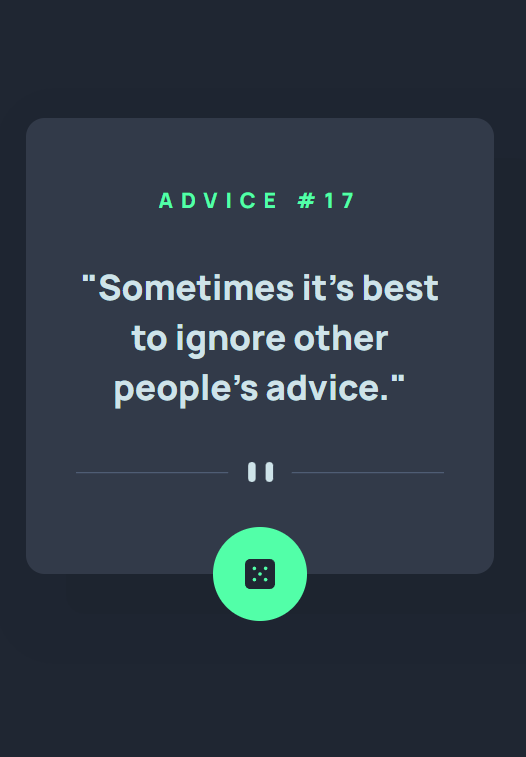

# Frontend Mentor - Advice generator app solution

This is a solution to the [Advice generator app challenge on Frontend Mentor](https://www.frontendmentor.io/challenges/advice-generator-app-QdUG-13db). Frontend Mentor challenges help you improve your coding skills by building realistic projects.

## Overview

### The challenge

Users should be able to:

- Generate a new piece of advice by clicking the dice icon
- View the optimal layout for the app depending on their device's screen size
- See hover states for all interactive elements on the page

Design:

### Screenshot

### Links

- Solution URL: [Solution](./solution/)
- Live Site URL: [Live site](https://spectacular-sprinkles-a2879a.netlify.app/)

### Built with

- React
- Reusable components (Card)
- Stateful components
- REST API
- Semantic HTML5 markup
- CSS custom properties
- Flexbox

## Author

- LinkedIn - [Daniel Westerlund](https://www.linkedin.com/in/daniel-westerlund-a07529179/)
- Website - [GitHub Pages](https://danielw720.github.io/)
- Frontend Mentor - [@DanielW720](https://www.frontendmentor.io/profile/yourusername)
